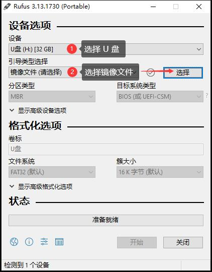
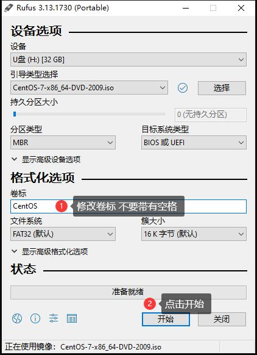
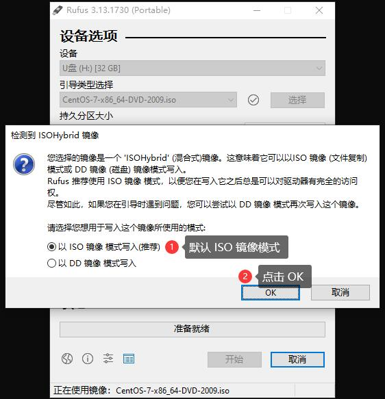
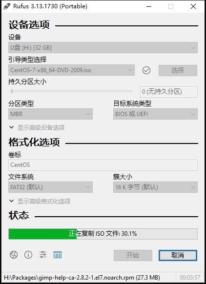

* content
{:toc}

# 安装 Cent OS 7 系统

## 工具

|软件|版本|关联|
|:--:|:--:|:--:|
|Runfus|v3.13.1730|[下载](../file/rufus-3.13p.exe)|
|CentOS 7|x86_64-DVD-2009|[下载](http://mirrors.aliyun.com/centos/7/isos/x86_64/CentOS-7-x86_64-DVD-2009.iso)|

## 烧录启动盘

1. 打开下载完的 rufus-3.13p.exe 文件，设置如下

2. 等待工具把 CentOS-7-x86_64-DVD-2009.iso 内的文件，原封不动的拷贝到 U 盘内

## 安装步骤

1. 按 F12 进入磁盘启动画面，选择刚才烧录好的 U 盘进行启动

2.